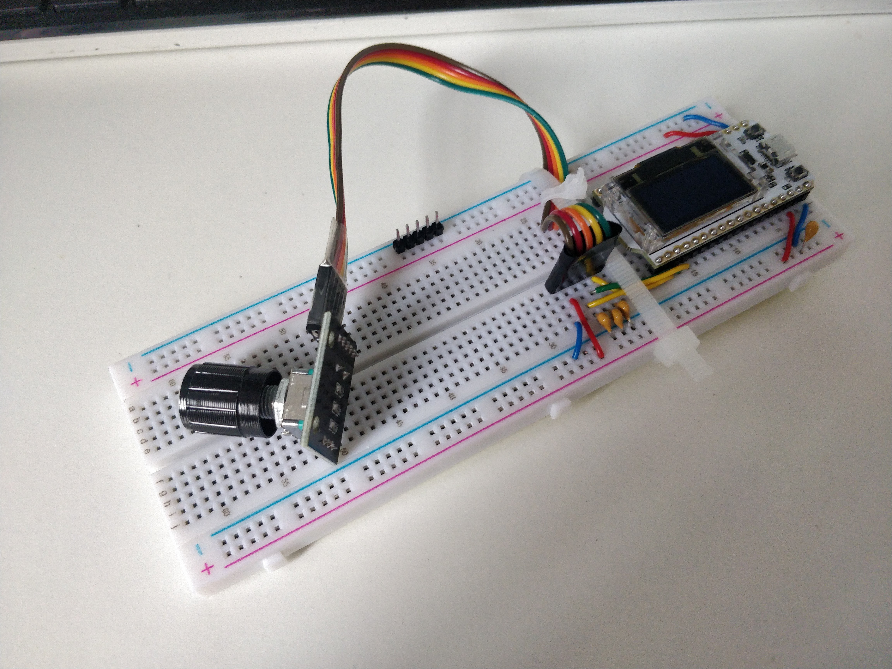

# Lab 0 - Unpacking Lab-in-Box

First I removed the various component bags and boxes from the lab-in-box and spread them across my desk. Next, I put the 9V battery into the multimeter and read the guide on how to use it, especially on how to measure resistances and capacitances.

Subsequently, I followed the Lab 0 guide on setting up the signal generator and rotary encoder (NOTE: I left sorting the resisters and capacitors to the end). This was completed via the following steps (copied from the instructions):

1. Using the hookup wires, connect the breadboard’s horizontal power strips to 3.3V and GND as shown on the right.
2. Separate the 10-way colour ribbon (M-F) into two 5-way cable. Plug one of them to the 5 pins of the rotary encoder and secure both end with some tapes as shown.Use half of the black insulation tape provided at the bottom of the component box to bind the 5 pins together as shown.
3. Pick up three 0.01uF (i.e. 10nF, code 103) capacitors from you component store and insert them between GND and three columns of connections as shown.  These are to be connected to the pins on the encoder labelled as CLK, DT and SW.
4. Insert three wires as shown between the three pins on the encoder and the ESP32 pins 23, 19and 22respectively. (Note: colour of the wired do not matter.  However, as they are signal wires, you should not use RED or BLUE.)
5. Connect the + pin on the encoder to 3.3V rail and GND pin to the GND rail. Always remember –use BLUE for GND, RED for 3.3V and the other colour for signals.
6. Plug in the 5-way ribbon cable attached to the encoder. Make sure that you have it the right-way-round.
7. Secure the ribbon cable onto the breadboard using cable tie so that it will not pull out easily.
8. Snap off 5pins from the 20 way header pin strip, and insert it on the lower GND rail. This will be used to connect the GND clip of the oscilloscope to your circuit.
9. Check to make sure that all your connections are made correctly, particularly the 3.3V and the GND wires.  Pick up a 1uF capacitor and insert it between 3.3V and GND.  This is called a de-coupling capacitor. Its purpose will be explained later.
10. Use the Micro-USB cable provided, connect the EPS32 module to a 5V USB power source. This could be your laptop USB port, a USB charger port or a USB portable power pack.

---

Here is an image of my board with all the steps finished. The board was tested with a micro-USB cable and functioned as expected.

