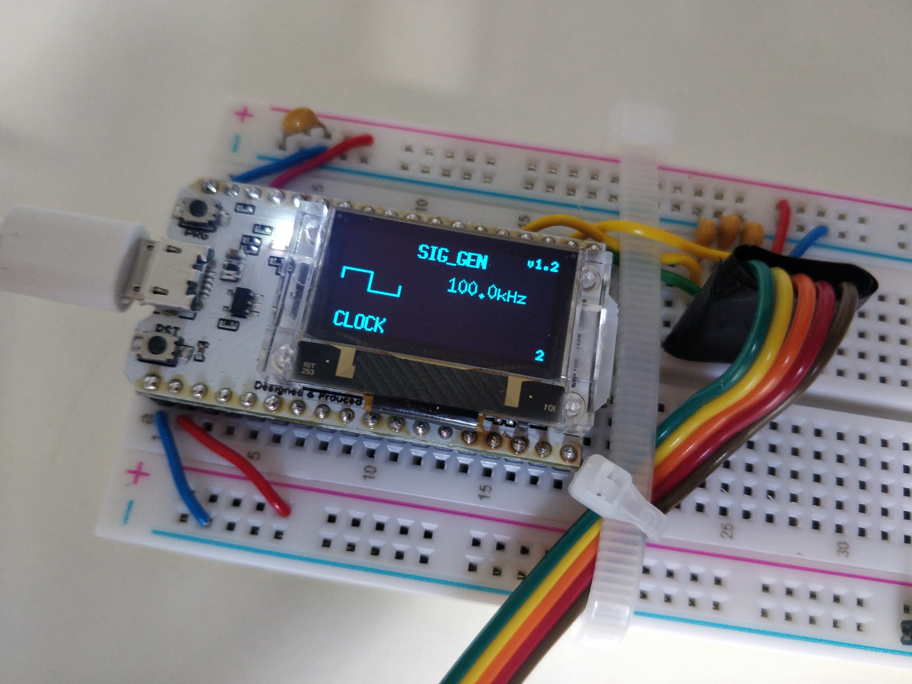

# Lab 1 - Signals and Scope

## Task 1 - Learning to control the signal generator

By following the instructions, I tried out using the different signal settings. Initially this did not work - I was unable to switch from the sine wave signal option, subsequently I realised that I had a wire wrong which I fixed, allowing me to test out the options.

## Task 2 - Setting up the oscilloscope

