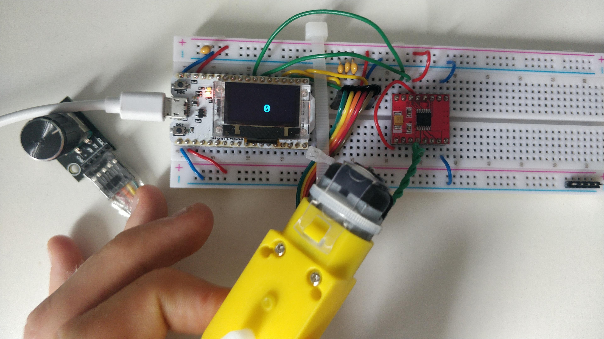

# DC Motor Controller

[**Homepage**](./index.html)

Challenge 3 (DC Motor Controller) was completed. The User is able to turn the rotary encoder and change the number on the oled panel from 0 to 100 - changing the speed the DC motor rotates at in the process. I used the following code for this challenge.

```python
# Challenge 3 - DC Motor Controller

import time
from machine import Pin, PWM
from oled import OLED
from rotary_irq_esp import RotaryIRQ

oled = OLED()
oled.init_display()

A1 = PWM(Pin(17), freq = 1000)
A2 = PWM(Pin(16), freq = 1000)

r = RotaryIRQ(
        pin_num_clk = 23,
        pin_num_dt = 19,
        min_val = 0,
        max_val = 100,
        reverse = True,
        range_mode = RotaryIRQ.RANGE_BOUNDED
)

val_old = r.value()

while True:
    val_new = r.value()

    if val_old != val_new:
        val_old = val_new
        oled.draw_text(
            32, 32, "{:4d}".format(val_new), size = 2, space = 2
        )
        oled.display()
  
        A1.duty(int(val_new * 10.23))
        A2.duty(0)

        time.sleep_ms(20)
```




[**Homepage**](./index.html)