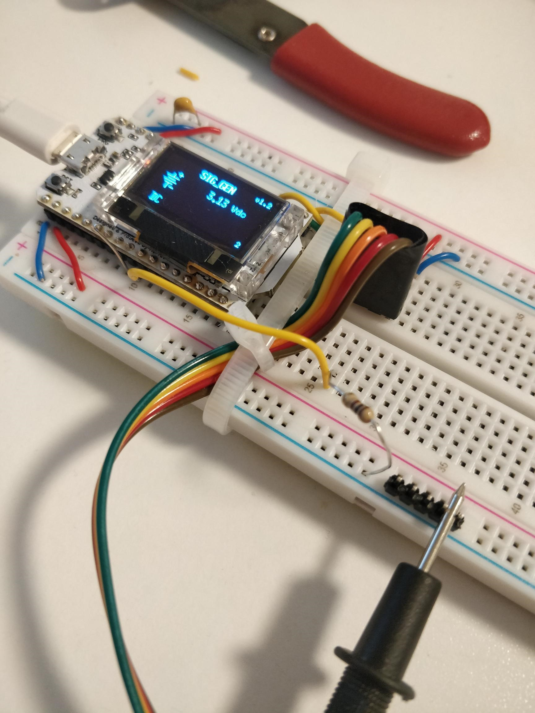
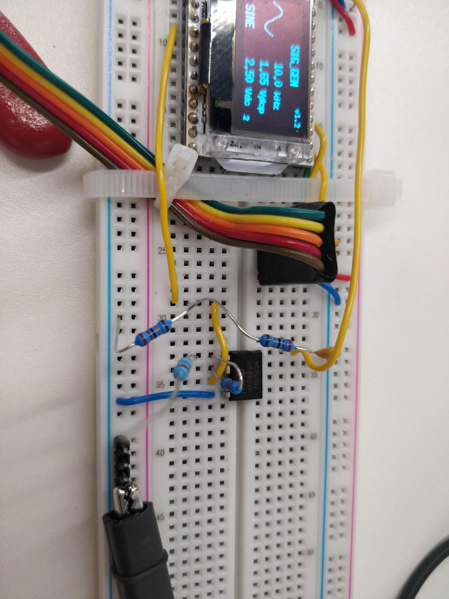
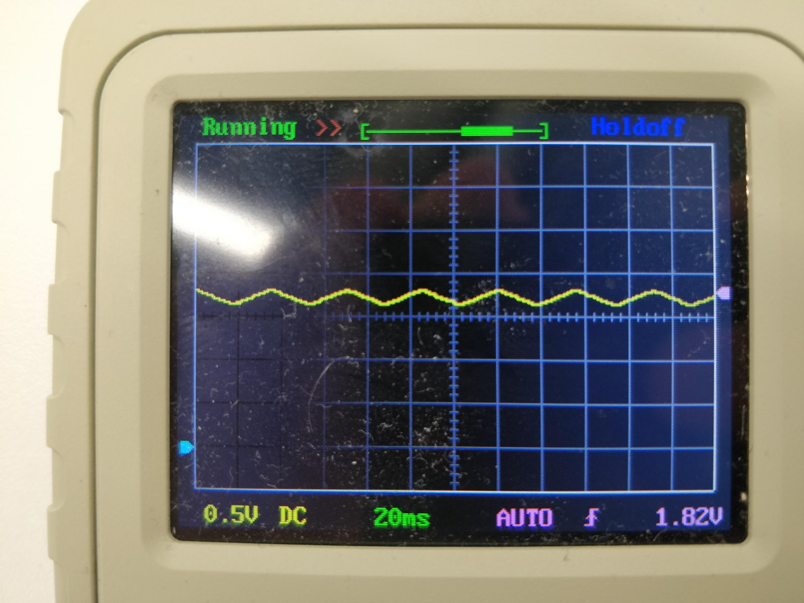

# Lab 2 - Electronic Circuits

**[Homepage](./index.html)**

## Task 1 - Calibration

The DC voltage output was calibrated as per the instructions:

| Voltage Setting | Measured Voltage | Error in % FS |
| --------------- | ---------------- | ------------- |
| 3.0 V           | 2.87             | 4.3           |
| 2.5 V           | 2.42             | 3.2           |
| 2.0 V           | 1.95             | 2.5           |
| 1.5 V           | 1.48             | 1.3           |
| 1.0 V           | 1.03             | 3.0           |
| 0.5 V           | 0.56             | 12            |

In order to achieve the correct output voltages for task 2, the following voltage settings for SIG_GEN were calculated.

| Measured Voltage | Voltage Setting |
| ---------------- | --------------- |
| 3.0 V            | 3.13            |
| 2.5 V            | 2.59            |
| 2.0 V            | 2.05            |
| 1.5 V            | 1.52            |
| 1.0 V            | 0.97            |
| 0.5 V            | 0.43            |

## Task 2 - Finding the source resistance of SIG_GEN

| V (measured) | Vs Setting | 10k  | 1k   | 100  | 69   |
| ------------ | ---------- | ---- | ---- | ---- | ---- |
| 3.0          | 3.13       | 3.0  | 2.97 | 2.29 |      |
| 2.0          | 2.05       | 1.9  | 1.97 | 1.92 |      |
| 1.0          | 0.97       | 0.99 | 0.98 | 0.96 |      |

Then, completing the second table for $R_L=69\ \Omega$  only,

| $V_s$ setting | $V_{\text{measured}}$ | $I_{\text{out}}$ | $R_s\ (\Omega)$ |
| ------------- | --------------------- | ---------------- | --------------- |
| 3.0           | 2.87                  | 47.0             |                 |
| 2.0           | 1.95                  | 41.4             |                 |
| 1.0           | 0.97                  | 33.4             |                 |

==n/a==

## Task 3 - Voltage Divider Circuit

- R1 and R2 were set to 10k V each, since current is the same and each resistors has the same value, the voltage at Vout was predicted to be half the (calibrated) SIG_GEN voltage -> 1.44 V. It was measured to be 1.42 V

- By using the ratio of the R1 and R2 resistances, I calculated Vout to be 2.06V. I measured it to be 1.96 V.

- $$
  R_{total}=10k+22k=32k\\
  \implies I=\frac{2.87}{32k}=8.97\times 10^{-5}\\
  \implies V_{R2}=IR_2=8.97\times 10^{-5}\times 22k=1.97 V
  $$

- The same voltages were measured for the AC signal

## Task 4 - Thévenin's Equivalent Network

$V_{th}$ was deduced to be 2.06V via standard calculations. 

==complete==

## Task 5 - Complex Resistor Network (R-2R ladder network)

The ladder network was set up as per the diagram. The 20k resistor was approximated with a 15k, 4.7k and 300 Ohm resistors in series (20 030 Ohms).

When measured, V1 = 0.98 V, V2 = 0.48 V. These line up with my predictions.

When the additional resister was added, V3 = 0.29 V. The pattern was that the voltage kept (roughly) dividing in half at each node.

## Task 6 - Driving a Light Emitting Diode

The LED first lights up at 2.42 V.

The exponential profile of the LED current and voltage shown in the Lab 2 task notes matches my observations as until the minimum voltage (2.42 V) there is no light from the LED and initially after that voltage the brightness increases slowly.

But after ~ 0.2 V the brightness increases as a very rapid rate.

Using a DC source is bad as you would require very fine control over the output voltage (which is usually not possible) to be able to finely adjust the LED brightness. Thus the brightness increases in very noticeable “steps”.

When using the PWM, the brightness of the LED seems to increase linearly with the duty cycle %. This allows for a far finer control of the brightness.

The frequency of the PWM signal has no influence on the LED brightness. This suggests that the maximum brightness would be largely controlled by the wave amplitude.

## Task 7 - RC circuit and exponential signal

After setting up the circuit as instructed, a zig-zag waveform was observed on the scope. It has a period of 36 ms, frequency of 27.8 Hz.

Theoretically $\tau=RC \implies \tau = 10k\times0.01\mu=0.1ms$ 

In practice,  I measured the time constant as being 5.9 ms.

When R1 and C1 were changed to 1k and C1 respectively, the waveform remained broadly the same on the scope.

The theoretical $\tau$ remains $0.1ms$, the measurements on the scope were also the same. From this, we deduced that the waveform of an RC circuit is only dependent on its time constant.

## Task 8 - RC circuit as a lowpass filter

| Frequency | Vout/Vs   |
| --------- | --------- |
| 100 Hz    | 1.54/1.65 |
| 500 Hz    | 1.46/1.65 |
| 1 kHz     | 1.29/1.65 |
| 4 kHz     | 0.56/1.65 |
| 100 kHz   | 0.04/1.65 |

==complete==

## Task 9 - PWM signal and lowpass filter

When using the PWM signal from SIG_GEN, an exponential-style signal is generated with Vmax = 1.62 V.

At 10 kHz V = 0.36 V and at 100 kHz V = 0.04 V. The output voltage is fairly unstable and very similar to that in task 8.

**[Homepage](./index.html)**