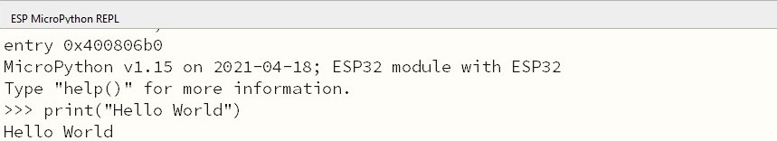
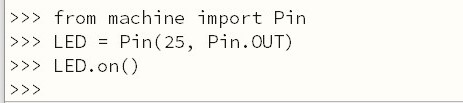
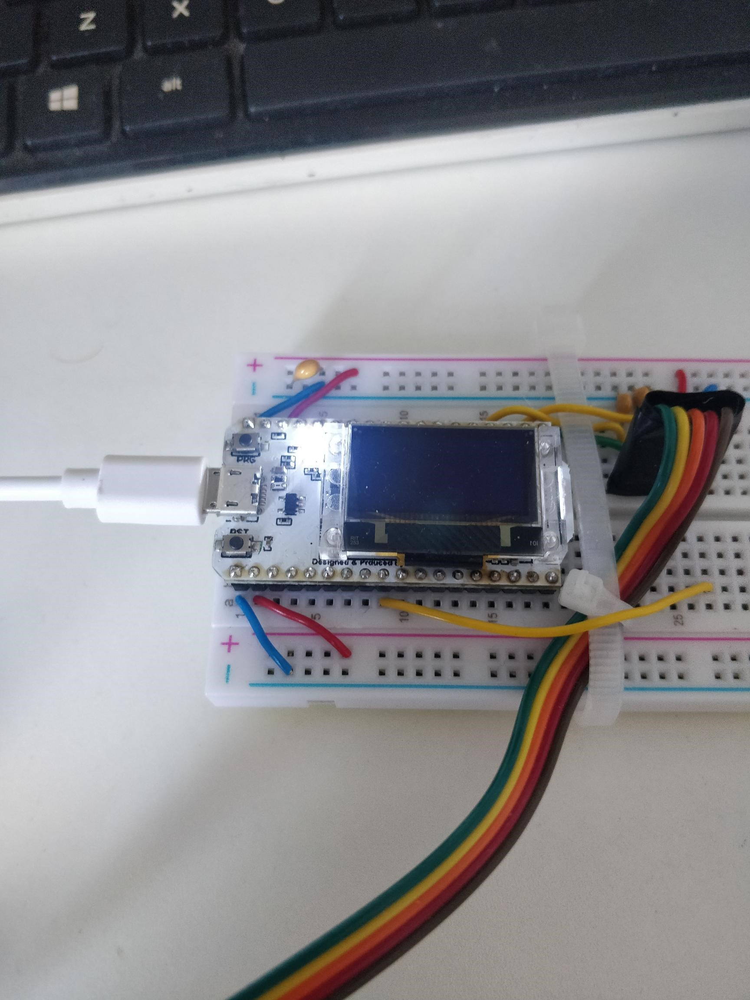
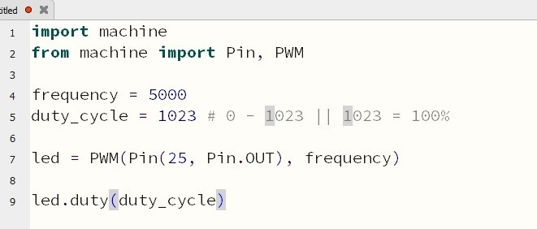
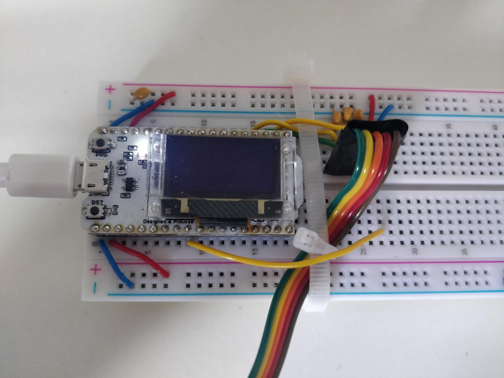

# Setting up MicroPython

**[Homepage](./index.html)**

## Task 1 & 2

The ESP32 device was flashed with micropython as per the instructions.

### Step 3

The LED light turned on as expected

### Step 4

The code was written as per the instructions and the light blinked as expected

## Task 4

The uPy classes and functions were explored. I completed the mini challenge, using PWM to change the brightness of the LED. The brightness changed when I changed the value of `duty_cycle`

## Task 5

### Step 1 & 2

The files were created and flashed as expected.

### Step 3

The uPy files were recreated in Mu and flashed across to ESP32. The screen displayed the `Hello World!` message.

[Homepage](./index.html)

