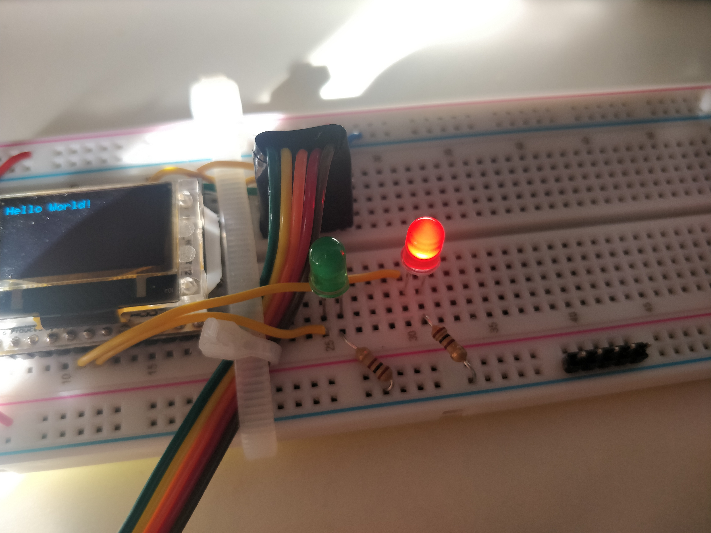
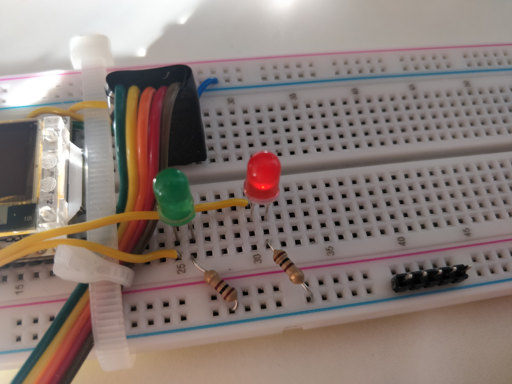
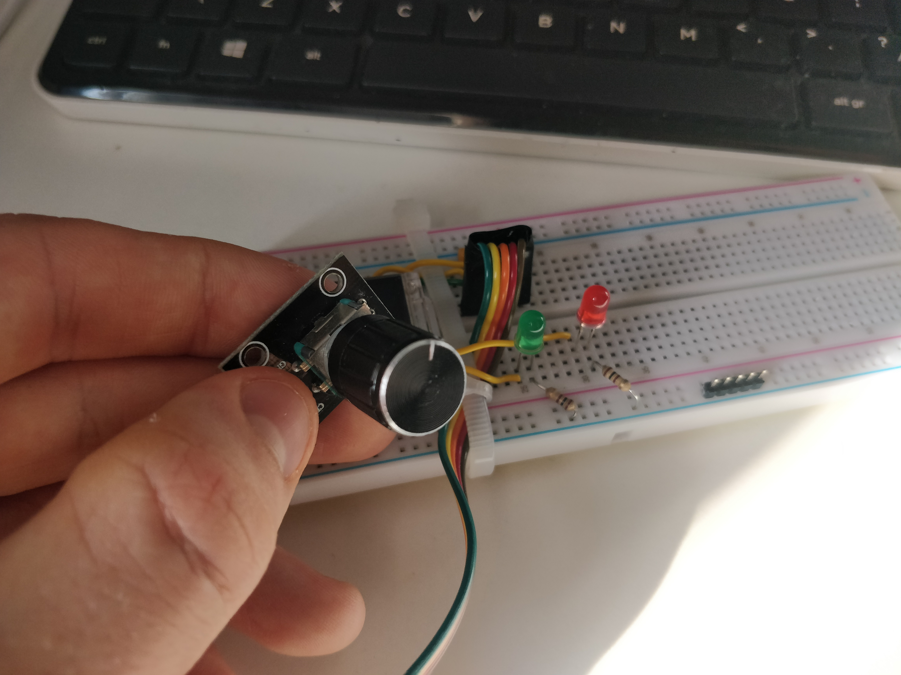
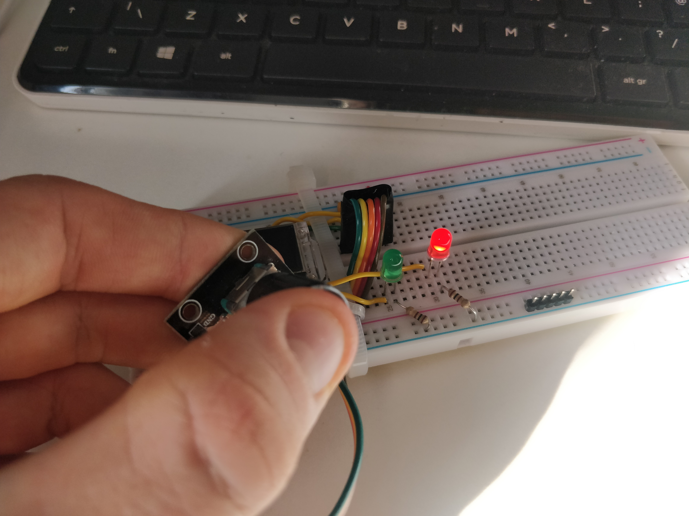
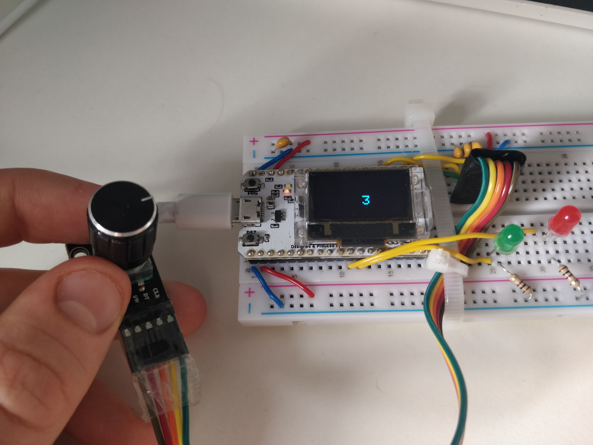
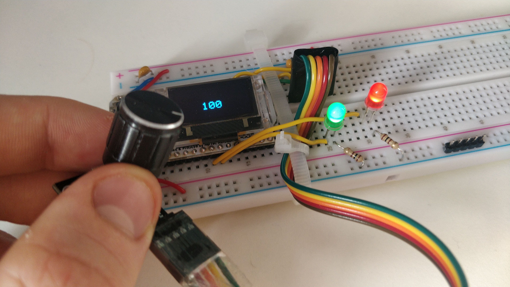
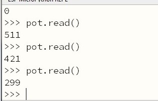
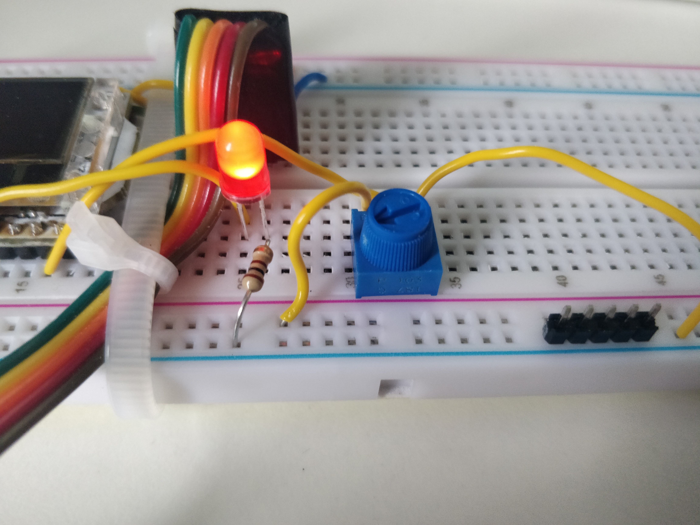
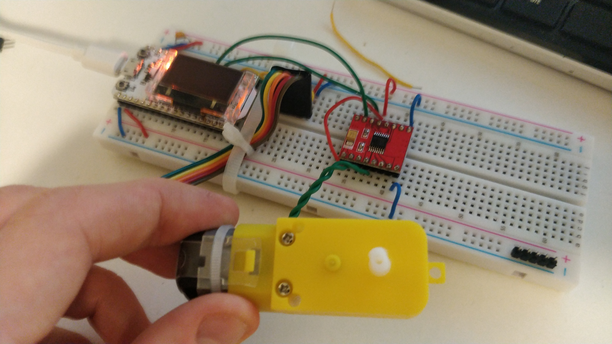
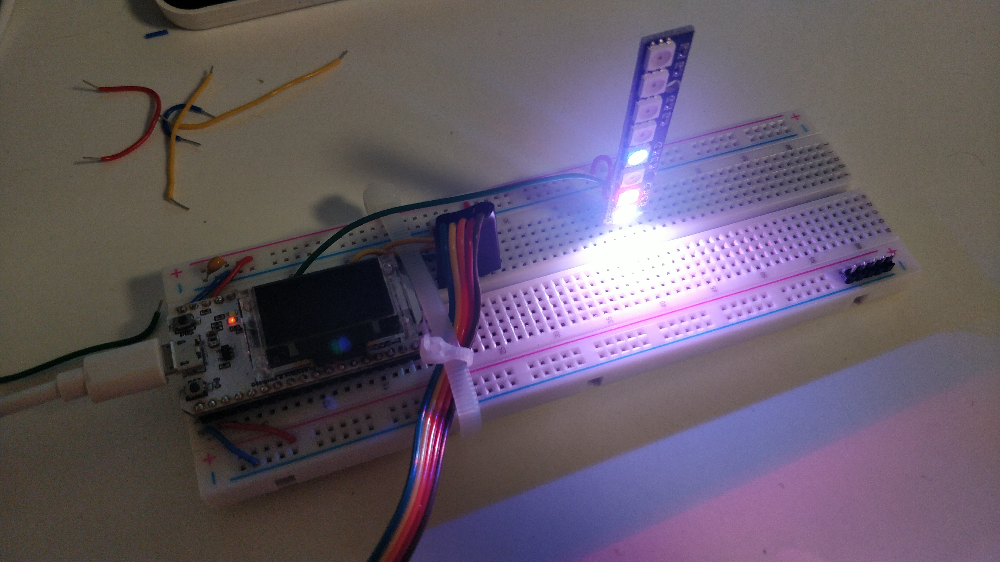

# Lab 4b - ESP32, Sensors, Drivers

[**Homepage**](./index.html)

## Task 1

The LEDs were installed as instructed. They lit up and PWM was used to alter their brightness.





I rewrote the varying brightness program `task1.py` in the editor and flashed it to ESP32. It worked as expected.

## Task 2

The code from Step 1 was tested.

For step 2 I wrote the following code in `task2a.py`, it functioned as expected.

```python
# uses the switch to turn on and off the rLED
from machine import Pin

rLED = Pin(33, Pin.OUT)
button = Pin(22, Pin.IN, Pin.PULL_UP)

while True: # loop forever
    if button.value() == 0:
        rLED.on()
    elif button.value() == 1:
        rLED.off()
```





In Step 3 the provided script was flashed onto the ESP32 and it yielded the expected results.


However when the capacitor was removed no “contact bounce” was noted, it acted the same as before.

## Task 3

For steps 1 and 2 the files were copied and transcribed respectively. The program was flashed and worked as expected.



In Step 4 `task3b.py` was altered to be the following code:

```python
# task3b.py

import time
from machine import Pin, PWM
from oled import OLED
from rotary_irq_esp import RotaryIRQ

rLED = PWM(Pin(33), freq = 1000)
gLED = PWM(Pin(32), freq = 1000)

oled = OLED()
oled.init_display()

r = RotaryIRQ(
        pin_num_clk = 23,
        pin_num_dt = 19,
        min_val = -100,
        max_val = 100,
        reverse = True,
        range_mode = RotaryIRQ.RANGE_BOUNDED
)
    
val_old = r.value()

while True:
    val_new = r.value()
    
    if val_old != val_new:
        val_old = val_new
        oled.draw_text(
            32, 32, "{:4d}".format(val_new), size = 2, space = 2
        )
        oled.display()
        rLED.duty(val_new)
        gLED.duty(val_new)
        time.sleep_ms(20)

```




## Task 4

The potentiometer was set up and values were read from it as per the instruction



Step 3 was skipped as I didn’t have a magnet.

For step 4 I wasn’t 100% sure what the question was asking, I assumed that I was meant to use the potentiometer to control the LED brightness. I used the following code

```python
from machine import Pin, ADC, PWM

rLED = PWM(Pin(33), freq = 1000)

pot = ADC(Pin(38))
pot.atten(ADC.ATTN_11DB)
pot.width(ADC.WIDTH_9BIT)

while True:
    duty = int((pot.read() / 511) * 1023)
    rLED.duty(duty)
```




## Task 5

Initially the servo Motor was tested with the provided code in REPL mode.

The extreme duty cycle values were tested.

Work in progress `task5.py` script:

```python
import time
from machine import Pin, PWM
from oled import OLED
from rotary_irq_esp import RotaryIRQ

oled = OLED()
oled.init_display()

servo = PWM(Pin(23), freq = 50)

r = RotaryIRQ(
        pin_num_clk = 23,
        pin_num_dt = 19,
        min_val = 20,
        max_val = 124,
        reverse = True,
        range_mode = RotaryIRQ.RANGE_BOUNDED
)
    
val_old = r.value()

while True:
    val_new = r.value()
    
    if val_old != val_new:
        val_old = val_new
        oled.draw_text(
            32, 32, "{:4d}".format(val_new), size = 2, space = 2
        )
        oled.display()
        
        servo.duty(val_new)
```


## Task 6

The circuit was constructed as instructed. When inputting the suggested code into the REPL terminal the expected outcomes were achieved.



## Task 7

The neopixel LED strip was installed as instructed. The suggested code was implemented, the results are as expected.



[**Homepage**](./index.html)

