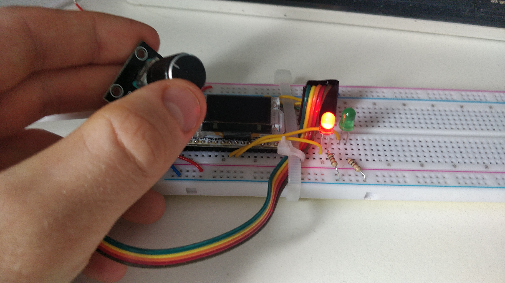
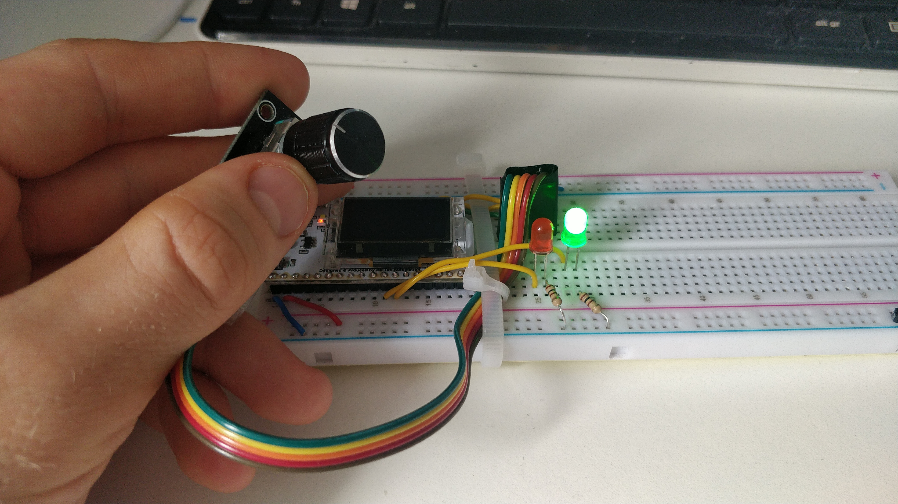

# Challenge 2: Traffic Light

I completed the second challenge (traffic light) using the following code:

```python
# Challenge 2 - Traffic Light
from machine import Pin
import time

rLED = Pin(33, Pin.OUT)
gLED = Pin(32, Pin.OUT)
button = Pin(22, Pin.IN, Pin.PULL_UP)

def traffic_sequence():
    # red on green off
    rLED.on()
    gLED.off()
    
    # wait 2 seconds
    time.sleep_ms(2000)
    
    # both off
    rLED.off()
    gLED.off()
    
    # wait 2 seconds
    time.sleep_ms(2000)
    
    # green on red off
    rLED.off()
    gLED.on()
    
    # wait 2 seconds
    time.sleep_ms(2000)
    
    # both off
    rLED.off()
    gLED.off()
    
while True:
    if button.value() == 0:
        traffic_sequence()
```






