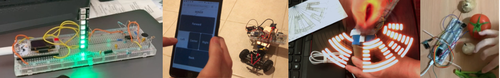

# Logbook for DE1 Electronics 1 - Max Matthews

This is my logbook for the laboratory tasks conducted for the DE1 Electronics 1 module. Below are links to the pages for each week’s lab.

[**Lab 0**: Unpacking Lab-in-Box](./Lab 0.html)

[**Lab 1**: Signals and Scope](./Lab 1.html)

[**Lab 2**: Electronic Circuits](./Lab 2.html)

---

Link to repository: [https://github.com/mlm20/electronics1-logbook](https://github.com/mlm20/electronics1-logbook)

